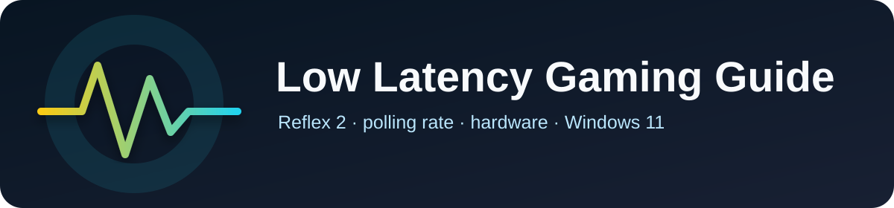

  
  
<strong>Guida tecnica a Reflex 2, polling rate e ottimizzazioni hardware/software.</strong>

  

    
    
    
  

  

    
    
    
    
    
  

## 📖 Contenuti

Questa guida copre:

- **NVIDIA Reflex 2 e Frame Warp**: analisi tecnica della tecnologia che riduce la latenza fino al 75%
- **Polling Rate 8K**: verità e marketing sui mouse gaming ad alta frequenza
- **Ottimizzazioni DPI**: calcoli matematici per sfruttare efficacemente diversi polling rate
- **Configurazioni Hardware**: setup ideali per latenza minima
- **Benchmark e Dati Reali**: confronti prestazionali documentati

## 💡 Hai Qualcosa da Aggiungere?

> **Contribuisci anche tu!**  
> Contributi, segnalazioni di errori e suggerimenti sono benvenuti! Apri una Issue o una Pull Request.
> Crea un nuovo report, migliora quelli esistenti o condividi la tua esperienza.  
> Diventa collaboratore e aiuta la community a crescere! 🎮

**Come contribuire:**
1. 🍴 Fai un Fork della repo
2. ✍️ Crea o migliora un report
3. 📤 Invia una Pull Request
4. 🎉 Diventa parte del team!

Hai domande? Scrivici su [Discord](https://discord.gg/ERUwSxE79q) o [Instagram](https://instagram.com/prime_build_)

## 🌐 Visualizza la Guida

👉 **[Apri la guida completa](https://primebuild-pc.github.io/low-latency-gaming-guide/)**

## 🛠️ Tecnologie

- HTML5 + CSS3
- Design responsive
- Navigazione a tab
- Ottimizzato per la lettura tecnica

## 📝 Licenza

Questo progetto è rilasciato con licenza **MIT** - sentiti libero di usarlo, modificarlo e condividerlo.

## 📧 Contatti

- **Discord**: [Prime Build Community](https://discord.gg/ze4g9EGr9D)
- **Instagram**: [@prime_build_](https://instagram.com/prime_build_)

## ⭐ Supporto

Se questa guida ti è stata utile, lascia una stella ⭐ sulla repository!

---

**Ultimo aggiornamento**: Dicembre 2025  
**Realizzato da**: Prime Build per la community❤️ 
